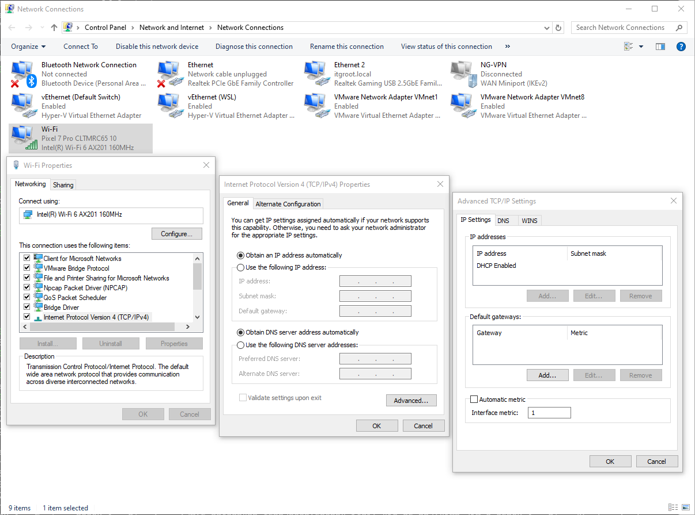
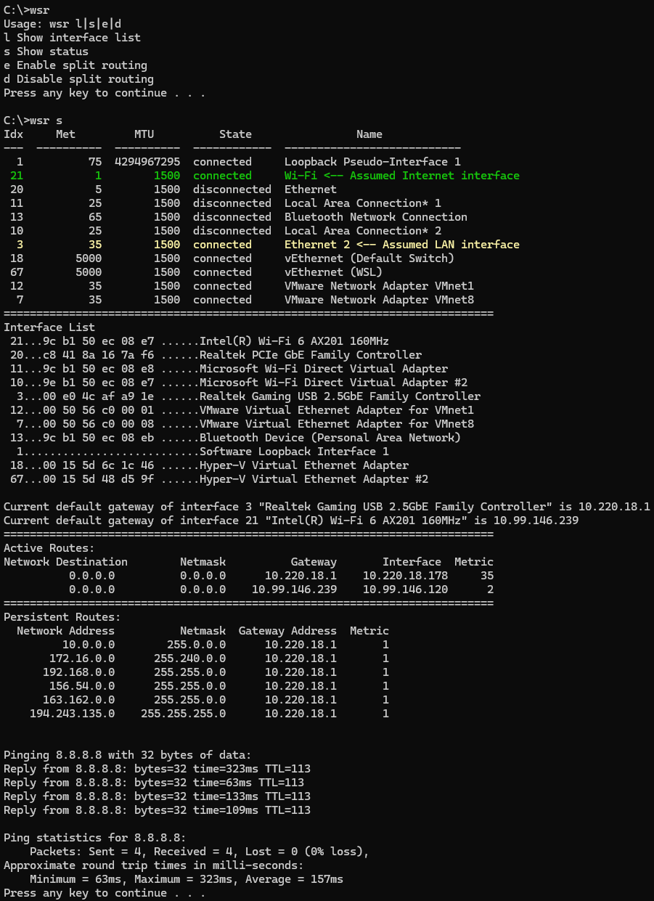

# Windows Split Routing - LAN and WiFi at the same time

## Problem Description

When Windows is connected to a WiFi hot-spot and there exist also a LAN interface (ethernet) the resulting routing table has two default gateways, one for each interface. One or the other is selected depending on the lowest automatic metric assigned to the interfaces.

If the metric of the wireless interface is lower, then all traffic goes through WiFi, except for destination ip addresses located in the local subnet (x.y.z.0/24) directly connected to the ethernet interface. Therefore any host located in a private subnet beyond a router connected to the local subnet can't be reached, because the ip packets destined for those hosts are routed through the wireless interface.

If on the contrary the ethernet interface has the lowest metric, all traffic goes through it, except perhaps for the /24 subnet associated to the wireless interface, where you are unlikely to find any useful resources. You can then reach those private subnets above, but you can't have a (direct) internet connection if it is not provided through the router, which is the usual case in an enterprise environment (filtered proxy anyone?).

## Solution Overview

By assigning to the wireless interface a fixed (not automatic) low metric value, less than the metric of the LAN interface, the interface and the corresponding default gateway will be prioritized by Windows. The corresponding nameserver (DNS) should be prioritized as well. This ensures that the public Internet can be reached via WiFi. You can set the metric as follows:

1. Run `ncpa.cpl`: the _Network Connections_ window appears
2. Right click on the wanted interface and select **Properties**
3. On the _Networking_ tab select **Internet Protocol Version 4 (TCP/IPv4)** then click on **[Properties]**
4. On the _General_ tab click on **[Advanced]**
5. On the _IP Settings_ tab locate _Automatic metric_ check-box and turn it off, then input the metric value in the _Interface metric_ text box
6. Confirm with OK and/or Close until the _Network Connections_ window is in focus again

By adding a dedicated route via the ethernet interface for each private subnet that is to be contacted, the traffic destined for those subnets will be routed through it instead of the wireless interface (mask based routing has priority over metric based routing). Well, of course this interface does not need to be of ethernet type, it can be any kind of interface leading to private subnets. Unfortunately, Windows does not provide a way to add routes besides using the `route` command in an elevated console window: you are supposed to know some routing concepts and to be familiar with the command line.

### How does the script `wsr.cmd` work?

1. The file itself contains a section in the beginning listing the private subnets which are known to be reachable through the LAN. This list is modifiable of course. You probably want to leave the first three subnets unchanged: those are the standard private subnets sanctioned by IANA.
2. You can identify the target interfaces by looking at the output of `wsr l` (list) and noting the interface names in the last column. Set the environment variables `INTERNET_IF_NAME` and `LAN_IF_NAME` accordingly. For example: `setx INTERNET_IF_NAME "Intel(R) Wi-Fi 6 AX201 160MHz"`.
3. Run `wsr e` (enable) ...
4. It sets the metric of the INTERNET interface to 1.
5. It finds and shows the metric and the default gateway of the LAN interface and the default gateway of the INTERNET interface.
6. It adds a persistent route via the default gateway of the LAN interface for each subnet listed in the beginning of the file itself.  Persistent routes survive rebooting.
7. When you don't need split routing anymore, run `wsr d` (disable).
8. When you don't remember the current status, run `wsr s` (status).

